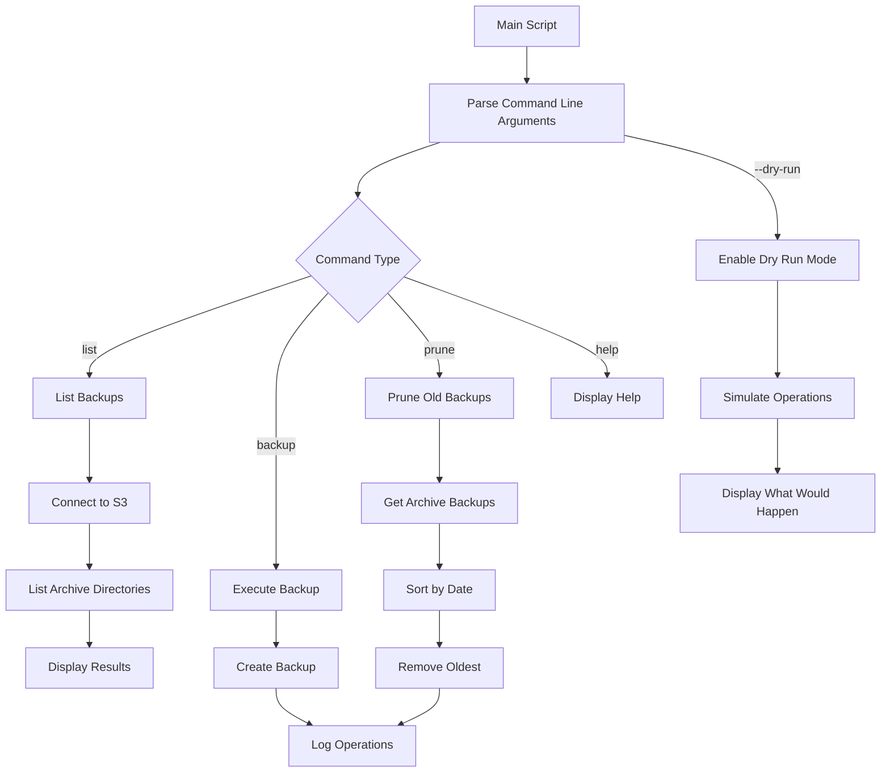

# 🔄 Backup Management Script Plan

## Table of Contents
- [Overview](#overview)
- [Current System Analysis](#current-system-analysis)
- [Requirements](#requirements)
- [Script Structure](#script-structure)
- [Command-Line Interface](#command-line-interface)
- [Core Functions](#core-functions)
- [Implementation Approach](#implementation-approach)
- [Security Considerations](#security-considerations)
- [Logging Strategy](#logging-strategy)
- [Retention Policy Implementation](#retention-policy-implementation)

## Overview 🌟

This document outlines the plan for creating a comprehensive backup management script that will serve as the central utility for all backup operations. The script will enhance the existing backup functionality while adding new features like backup listing, retention policy management, and dry-run capabilities.

## Current System Analysis 🔍

The current backup system:
- Uses rclone to sync the root directory to an AWS S3 bucket
- Creates archive backups with timestamps
- Uses a filter file to exclude specific directories and files
- Logs operations to a timestamped log file
- Uses AWS S3 credentials from the rclone configuration file

```bash
#!/usr/bin/env bash

TIMESTAMP=$(date +%Y%m%d_%H%M%S)

rclone sync / aws-s3:cmiranda-backup-beast/current \
  --backup-dir aws-s3:cmiranda-backup-beast/archive/$TIMESTAMP \
  --filter-from $HOME/.config/rclone/filter.txt \
  --copy-links \
  --transfers 64 \
  --checkers 64 \
  --s3-chunk-size 512M \
  --buffer-size 512M \
  --multi-thread-streams 16 \
  --stats 2s \
  --log-level DEBUG \
  --log-format "date,time" \
  --log-file $HOME/logs/rclone-backup_$TIMESTAMP.log \
  --progress \
  --fast-list \
  --retries 2
```

## Requirements 📋

1. **Command-Line Interface**:
   - Support for different operations (list, backup, prune)
   - Short and long format flags
   - Help function

2. **Backup Management**:
   - Execute full backups (manually or via cron)
   - List existing backups
   - Configure retention policy

3. **Retention System**:
   - Maintain the last N archive backups
   - Automatically prune oldest archives

4. **Dry-Run Capability**:
   - Preview actions without executing them
   - Show what would be backed up or pruned

5. **Code Quality**:
   - Extract hardcoded values into named constants
   - Preserve existing backup command structure
   - Comprehensive error handling

6. **Security**:
   - Read AWS S3 credentials from ~/.config/rclone/rclone.conf
   - No hardcoded credentials

7. **Directory Structure Management**:
   - s3://cmiranda-backup-beast/archive/
   - s3://cmiranda-backup-beast/archive/[DATE_TIMESTAMP]/
   - s3://cmiranda-backup-beast/current/

8. **Logging**:
   - Log all operations to $HOME/logs/rclone-backup_[TIMESTAMP].log
   - Configurable log levels

## Script Structure 🏗️



### Constants and Configuration 🔧

```bash
# S3 bucket configuration
S3_BUCKET_NAME="cmiranda-backup-beast"
S3_CURRENT_DIR="current"
S3_ARCHIVE_DIR="archive"

# Rclone configuration
RCLONE_CONFIG_PATH="$HOME/.config/rclone/rclone.conf"
RCLONE_FILTER_PATH="$HOME/.config/rclone/filter.txt"
RCLONE_REMOTE="aws-s3"

# Backup settings
DEFAULT_RETENTION=5
LOG_DIR="$HOME/logs"
LOG_PREFIX="rclone-backup"

# Rclone performance settings
TRANSFERS=64
CHECKERS=64
CHUNK_SIZE="512M"
BUFFER_SIZE="512M"
MULTI_THREAD_STREAMS=16
RETRIES=2
```

## Command-Line Interface 💻

```
Usage: backup [OPTIONS] COMMAND

A comprehensive backup management utility

Commands:
  backup    Execute a full backup
  list      List existing backups
  prune     Remove old backups based on retention policy
  help      Display this help message

Options:
  -r, --retention N    Keep the last N archive backups (default: 5)
  -v, --verbose        Enable verbose output
  -q, --quiet          Suppress all output except errors
  -d, --dry-run        Preview actions without executing them
  -h, --help           Display help for the specified command
```

## Core Functions 🧩

### Backup Function

```bash
function execute_backup() {
    # Create timestamp
    # Set up logging
    # Check for dry-run mode
    # Execute rclone command with proper parameters
    # Prune old backups if retention is set
}
```

### List Backups Function

```bash
function list_backups() {
    # Connect to S3
    # List archive directories
    # Sort by date
    # Display results with size and date information
}
```

### Prune Backups Function

```bash
function prune_backups() {
    # Get list of archive backups
    # Sort by date
    # Check for dry-run mode
    # Keep the most recent N backups based on retention setting
    # Remove the oldest backups
}
```

### Help Function

```bash
function show_help() {
    # Display general help or command-specific help
    # Include examples and usage information
}
```

### Dry-Run Implementation

```bash
function enable_dry_run() {
    # Set dry-run flag for rclone
    # Modify output to indicate simulation
    # Prevent actual deletion in prune function
}
```

## Implementation Approach 📝

1. **Phase 1: Script Structure and Constants**
   - Create the basic script structure
   - Define all constants and configuration variables
   - Implement command-line argument parsing

2. **Phase 2: Core Functionality**
   - Implement the backup function preserving existing functionality
   - Implement the list backups function
   - Implement the prune backups function
   - Implement dry-run mode

3. **Phase 3: Help System and Error Handling**
   - Implement comprehensive help system
   - Add error handling and validation
   - Implement verbose/quiet modes

4. **Phase 4: Testing and Refinement**
   - Test all functions with various parameters
   - Verify retention policy works correctly
   - Test dry-run mode functionality
   - Ensure backward compatibility with existing usage

## Security Considerations 🔒

- AWS S3 credentials will be read from the rclone configuration file
- No credentials will be hardcoded in the script
- Proper error handling for missing or invalid credentials
- Validate user input to prevent command injection

## Logging Strategy 📊

- All operations will be logged to a timestamped log file
- Log level will be configurable (DEBUG by default)
- Log format will include date and time
- Log directory will be created if it doesn't exist
- Special handling for dry-run mode in logs

## Retention Policy Implementation 🗑️

```mermaid
flowchart TD
    A[Get Retention Setting] --> B[List Archive Backups]
    B --> C[Sort by Date]
    C --> D{More than N backups?}
    D -->|Yes| E[Remove Oldest Backups]
    D -->|No| F[Do Nothing]
    E --> G[Log Removed Backups]

    A --> H{Dry Run Enabled?}
    H -->|Yes| I[Simulate Removal]
    I --> J[Display What Would Be Removed]
    H -->|No| B
